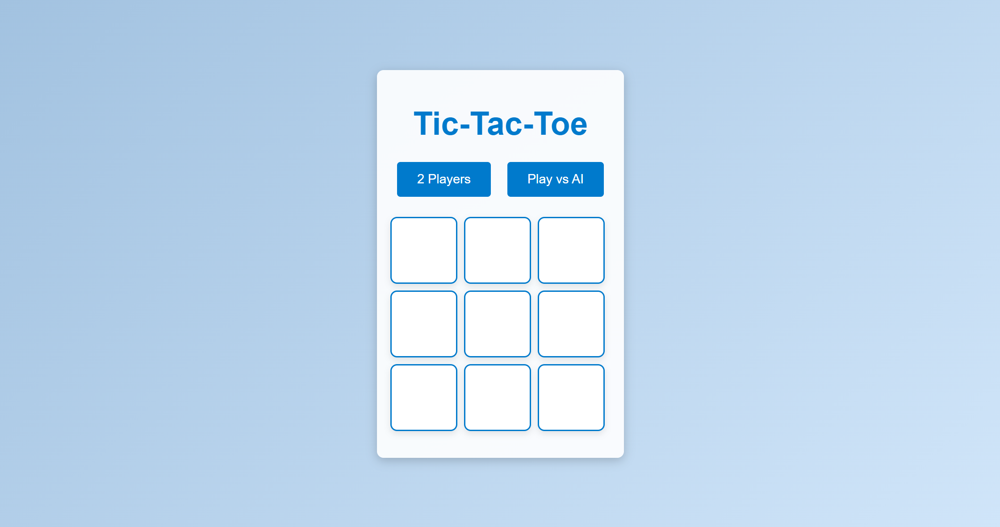
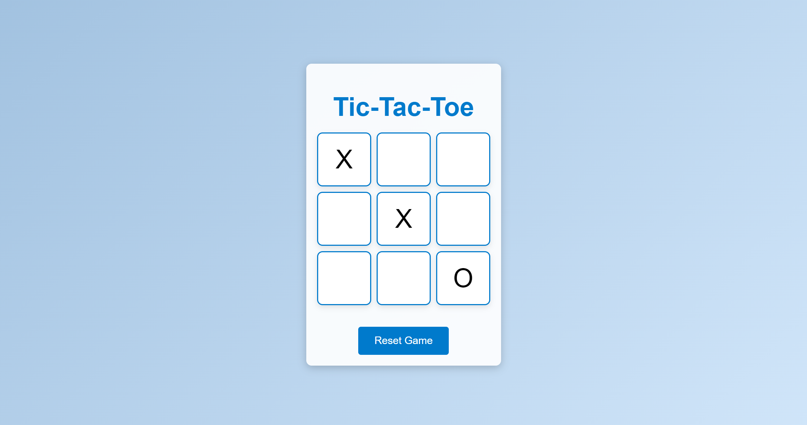

# Tic-Tac-Toe Web Application

## Overview

This project is a simple web-based Tic-Tac-Toe game. Players can choose to play against another person (2 Players) or compete against an AI opponent. The game features a 3x3 grid where players aim to align three of their markers in a row, either horizontally, vertically, or diagonally.

## Features

- **Two Game Modes:**
  - **2 Players:** Play against another person on the same device.
  - **Play vs AI:** Compete against a simple AI opponent.
- **Interactive Grid:** A 3x3 grid for players to make their moves.
- **AI Delay:** Simulates a more realistic game experience with a brief delay before the AI makes a move.
- **Reset Option:** Restart the game anytime with a reset button.
- **Responsive Design:** Optimized for different screen sizes and devices.

## Screenshots

### Main Menu

### Game Board

## Technologies Used

- **HTML:** For structuring the game layout.
- **CSS:** For styling the game interface and animations.
- **JavaScript:** For game logic, including player interactions and AI behavior.

